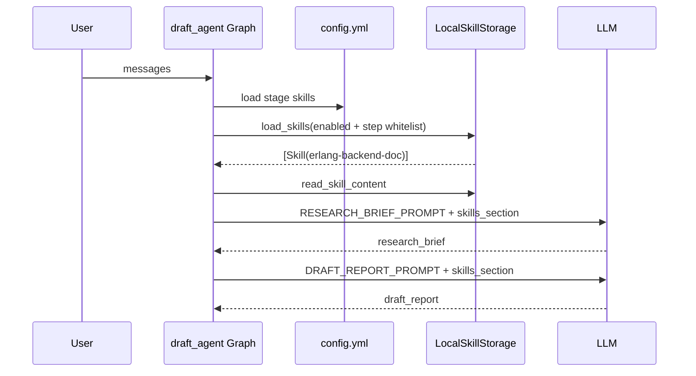

# Skill 系统实现说明

本文档说明 `doc_generation` 项目中**可插拔 Skill 系统**的设计思路、与 [deer-flow2](https://github.com/mssnzxm/deer-flow2) 的对应关系，以及如何扩展与使用。

---

## 1. 设计目标


| 目标                    | 说明                                                               |
| --------------------- | ---------------------------------------------------------------- |
| **可插拔**               | 存储后端、启用策略、注入方式均可通过配置切换，无需改业务代码                                   |
| **与 deer-flow2 协议兼容** | 沿用 `SKILL.md` + YAML frontmatter、`public`/`custom` 目录约定          |
| **适配当前项目**            | `draft_agent` 使用结构化 LLM 调用、无 `read_file` 工具，因此默认 **inline** 注入全文 |
| **渐进扩展**              | 未来接入带工具的 Agent 时，可切换为 **catalog** 模式（仅列目录，由模型按需读文件）              |


---

## 2. 参考来源：deer-flow2 做了什么

deer-flow2 的 Skill 能力核心包括：

1. **Skill 即目录 + `SKILL.md`**：frontmatter 描述 `name`、`description` 等，正文为工作流说明。
2. `**SkillStorage` 抽象**：`LocalSkillStorage` 扫描 `skills/public`、`skills/custom`，递归发现嵌套 skill。
3. **配置驱动**：`config.yaml` 中 `skills.use` 指定实现类路径；`extensions` 控制启用状态。
4. **Prompt 中的渐进加载**：系统提示列出 skill 名称与容器内路径，由 Agent 在需要时 `read_file` 读取 `SKILL.md` 及 `references/` 等。

本项目的实现**保留了 1～3 的骨架**，对第 4 点按「无工具节点」做了简化（见第 5 节）。

---

## 3. 整体架构

```
config.yml (stages.prod.skills)
        │
        ▼
  SkillsConfig ──────────────┐
        │                    │
        ▼                    ▼
  registry.get_or_new_skill_storage()
        │                    │
        │ resolve_class(skills.use)
        ▼                    ▼
  LocalSkillStorage (可替换) ──► load_skills()
        │                    │
        │ _iter_skill_files + parse_skill_file
        ▼                    ▼
  list[Skill] ──► prompt.build_skills_context()
        │
        ├── mode=inline  → 读取 SKILL.md 正文，嵌入 prompt
        └── mode=catalog → 仅输出 skill 元数据与路径（deer-flow 风格）
        │
        ▼
  draft_agent: RESEARCH_BRIEF_PROMPT / DRAFT_REPORT_PROMPT
               占位符 {skills_section}
```

### 3.1 模块职责


| 模块     | 文件                                      | 职责                                             |
| ------ | --------------------------------------- | ---------------------------------------------- |
| 类型     | `skills/types.py`                       | `Skill`、`SkillCategory`、`SKILL_MD_FILE`        |
| 解析     | `skills/parser.py`                      | 解析 frontmatter；`read_skill_body()` 去掉 YAML 头   |
| 存储抽象   | `skills/storage/skill_storage.py`       | `load_skills()` 模板方法；按名称去重，custom 优先           |
| 本地存储   | `skills/storage/local_skill_storage.py` | 遍历 `public/`、`custom/`，跳过隐藏目录                  |
| 配置     | `skills/config.py`                      | 从 stage 配置构建 `SkillsConfig`；解析路径与白名单           |
| 注册表    | `skills/registry.py`                    | `module:Class` 反射实例化；单例 / 按请求新建                |
| Prompt | `skills/prompt.py`                      | `build_skills_context()`：inline / catalog 两种输出 |
| 集成     | `agents/draft_agent.py`                 | 按 agent + step 加载 skill，填入 prompt              |


---

## 4. Skill 目录约定

与 deer-flow2 一致：

```
skills/
├── public/                    # 内置、随仓库分发
│   └── erlang-backend-doc/
│       └── SKILL.md
└── custom/                    # 用户自定义（可覆盖同名 public skill）
    └── my-skill/
        └── SKILL.md
```

### 4.1 `SKILL.md` 格式

```markdown
---
name: erlang-backend-doc
description: >-
  简短描述；用于匹配任务场景
---

# 正文标题

具体工作流、表格、原则……
```

- **必填**：`name`（hyphen-case）、`description`
- **可选**：`license`、`allowed-tools`（deer-flow 用于工具策略，本项目暂未接工具层）

### 4.2 发现与冲突策略

- 自顶向下 `os.walk`，跳过以 `.` 开头的目录。
- 以 **skill 的 `name`（frontmatter）** 为唯一键，而非目录名。
- 若 `public` 与 `custom` 同名：**custom 覆盖 public**（与 deer-flow2 测试行为一致）。

---

## 5. 两种 Prompt 注入模式

### 5.1 `inline`（本项目默认）

**原因**：`write_research_brief` / `write_draft_report` 通过 `with_structured_output` 单次调用 LLM，没有文件读取工具，无法在运行时「按需打开 SKILL.md」。

**做法**：`get_skills_inline_section()` 读取每个已启用 skill 的正文（去掉 frontmatter），包在 `<skill name="...">` 中，整体放入 `{skills_section}`。

**优点**：模型一定能看到完整 skill 指令。  
**缺点**：skill 很长时会占用 context；适合当前体量较小的领域 skill。

### 5.2 `catalog`（deer-flow 风格）

**做法**：`get_skills_catalog_section()` 只输出 skill 名称、描述、分类标签、`SKILL.md` 路径。

**适用**：将来若有带 `read_file` 的 ReAct Agent，可设 `mode: catalog`，由模型按 deer-flow 的 **Progressive Loading** 自行读取。

配置示例：

```yaml
skills:
  mode: catalog   # 默认 inline
```

---

## 6. 配置模型（三层过滤）

配置位于 `config.yml` → `stages.<stage>.skills`：

```yaml
skills:
  use: doc_generation.skills.storage.local_skill_storage:LocalSkillStorage
  path: skills
  enabled:
    - erlang-backend-doc
  mode: inline
  agents:
    draft:
      write_research_brief:
        skills:
          - erlang-backend-doc
      write_draft_report:
        skills:
          - erlang-backend-doc
```


| 层级         | 字段                             | 含义                                          |
| ---------- | ------------------------------ | ------------------------------------------- |
| 全局         | `use`                          | 存储实现类路径（可插拔）                                |
| 全局         | `path`                         | skill 根目录；相对路径相对于**项目根**                    |
| 全局         | `enabled`                      | 全局白名单；省略则加载所有已发现 skill                      |
| 全局         | `mode`                         | `inline` 或 `catalog`                        |
| Agent/Step | `agents.<agent>.<step>.skills` | 该节点可用 skill；省略则继承 agent 级；再省略则用全部 `enabled` |


**路径解析顺序**（`SkillsConfig.get_skills_path()`）：

1. 配置中的 `path`（相对项目根）
2. 环境变量 `DOC_GENERATION_SKILLS_PATH`
3. 默认 `<项目根>/skills`

**Agent 集成**（`draft_agent.py`）：

```python
skills_section = _skills_section("write_research_brief")
prompt = RESEARCH_BRIEF_PROMPT.format(..., skills_section=skills_section)
```

`_skills_section(step)` 从当前 stage（默认 `prod`）加载 `SkillsConfig`，再调用 `build_skills_context(agent="draft", step=step)`。

---

## 7. 可插拔点说明

### 7.1 替换存储后端

实现 `SkillStorage` 子类，至少实现：

- `get_skills_root_path() -> Path`
- `_iter_skill_files() -> Iterable[tuple[SkillCategory, Path, Path]]`

在配置中修改：

```yaml
skills:
  use: my_company.skills.s3_storage:S3SkillStorage
```

`registry.resolve_class()` 通过 `importlib` 加载类并校验继承关系。

### 7.2 工厂与单例

`get_or_new_skill_storage()` 行为：


| 调用方式                | 行为                         |
| ------------------- | -------------------------- |
| `skills_path=...`   | 每次新建实例（测试常用）               |
| `skills_config=...` | 按该配置新建（draft_agent 使用）     |
| 无参数                 | 进程内单例（默认 `SkillsConfig()`） |


测试可用 `reset_skill_storage()` 清空单例。

### 7.3 与 deer-flow2 有意简化的部分


| deer-flow2                      | 本项目                         |
| ------------------------------- | --------------------------- |
| `extensions_config` 持久化启用状态     | 仅用 `config.yml` 的 `enabled` |
| `skill_manage_tool`、ZIP 安装、安全扫描 | 未实现（可按需加 gateway）           |
| `allowed-tools` 过滤工具列表          | 类型已解析，未接 tool 层             |
| 容器路径 `/mnt/skills`              | 使用本机绝对路径（inline/catalog）    |
| Skill 自进化 prompt 段              | 未实现                         |


这些可在不改动 `draft_agent` 主流程的前提下逐步补齐。

---

## 8. 数据流示例（draft 流程）




---

## 9. 如何新增一个 Skill

1. 在 `skills/public/<目录名>/SKILL.md` 或 `skills/custom/` 下创建文件。
2. frontmatter 中 `name` 与全局唯一（建议与目录名一致）。
3. 在 `config.yml` 的 `skills.enabled` 中加入该 `name`。
4. 在 `agents.draft.<step>.skills` 中绑定到对应节点。
5. 运行测试：`pytest tests/test_skills_loader.py`

本地快速验证注入内容：

```bash
python -c "from doc_generation.agents.draft_agent import _skills_section; print(_skills_section('write_research_brief')[:800])"
```

---

## 10. 测试覆盖

`tests/test_skills_loader.py` 验证：

- 嵌套目录发现多个 skill
- custom 覆盖 public 同名 skill
- inline 模式正文进入 prompt
- `skills.use` 反射加载 `LocalSkillStorage`

---

## 11. 设计取舍小结

1. **协议对齐、实现精简**：复用 deer-flow2 的目录与 `SKILL.md` 规范，降低未来迁移或共用 skill 库的成本。
2. **存储与 Prompt 解耦**：`SkillStorage` 只负责发现与读文件；`prompt` 模块决定如何写给 LLM。
3. **配置分层**：全局启用 + Agent/Step 白名单，避免所有节点加载全部 skill。
4. **默认 inline**：匹配当前无工具的结构化输出链路；`catalog` 为后续扩展预留。
5. **可插拔 `use`**：与 deer-flow2 `skills.use` + `resolve_class` 同一模式，便于接 S3、Git、DB 等后端。

如需扩展安装 API、Web 管理页或工具策略，建议以 `SkillStorage` 和 `build_skills_context` 为边界向外加，而不修改 `draft_agent` 的核心图结构。